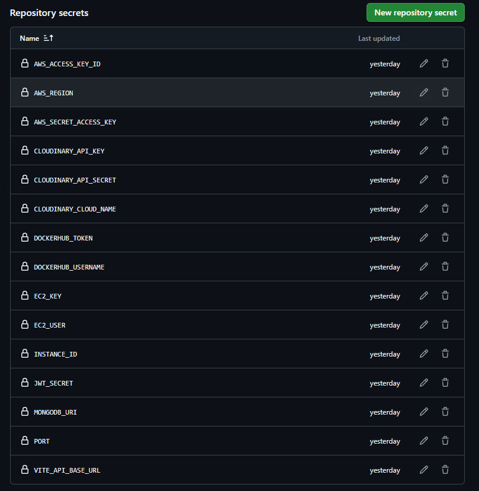
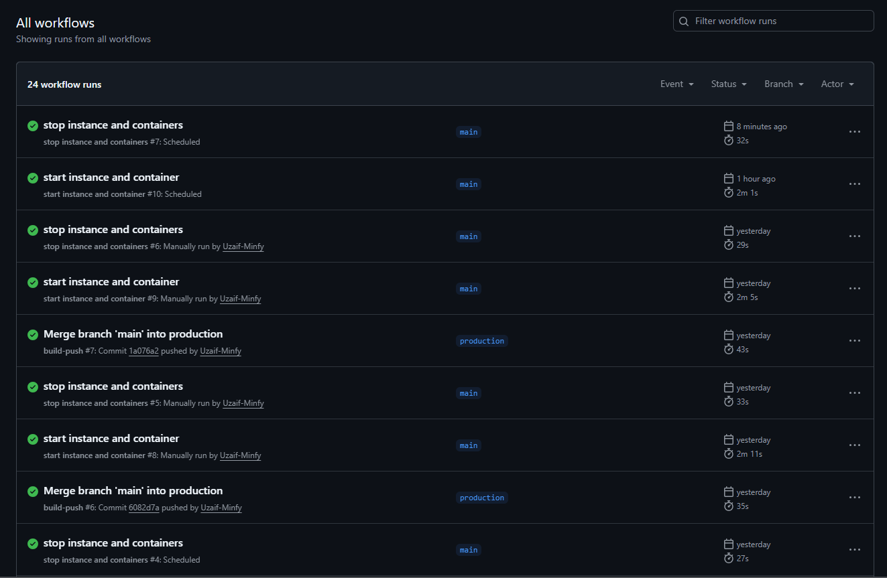

# 🚀 Full Stack App – Bun + React + Express

This is a full-stack web application built with:

- ⚙️ **Backend**: Express (running with Bun)
- 🎨 **Frontend**: React (Vite + Bun)
- 🛡️ **Authentication**: JWT-based auth
- 🌐 **Ports**: Backend – `5000`, Frontend – `5173`

---
## Steps to run the project

```bash
git clone https://github.com/your-username/your-repo-name.git
cd your-repo-name
```
## For backend
```bash
bun install
bun index.js
```


## For Frontend
```bash
cd ../frontend
bun i
bun run dev
```


#  CI/CD Workflows

## 1. **Build & Push Docker Images**

- Triggered **on push to `production`**.  
- Builds Docker images using `docker-compose` and pushes them to DockerHub.

## 2. **Start EC2 & Deploy**

- Triggered automatically at **10:00 AM IST (Mon–Fri)**
- Or manually from GitHub Actions
- Starts EC2 instance, pulls latest images, and runs containers

## 3. **Stop EC2 & Clean Up**

- Triggered automatically at **11:00 AM IST (Mon–Fri)**
- Or manually from GitHub Actions
- Stops containers and EC2 instance

## **Repository Secrets**




## **Repository workflows**



